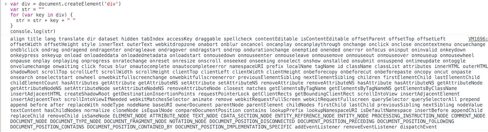
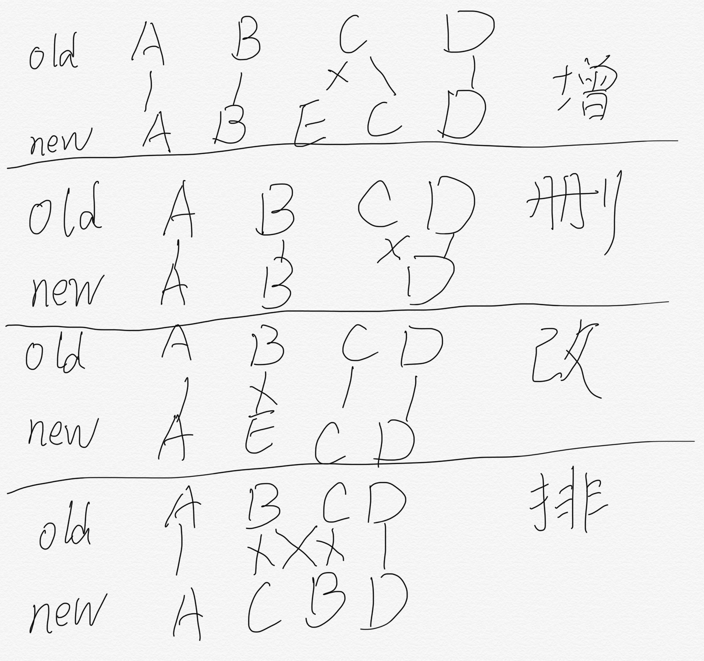

# 我们为何需要VDOM&如何打造VDOM (1)
> topic: 这次分享的标题是 " 我们为何需要VDOM&如何打造VDOM (1) "， 这是两个主题： “我们为何需要VDOM”，以及 “如何打造VDOM (1)”， 没错，这个 (1) 其实归属于后方，也就是说，今天，我会尽量让大家明白 “我们为何需要VDOM”， 然后让感兴趣的同学明白我是如何实现一个VDOM的， 最后，我下次会在前端组内分享我的详细实现流程。

## 1. 我们为何需要VDOM
### 1> 什么是VDOM
> note: 要理解为什么需要VDOM，肯定先要定位好什么是VDOM

* **VDOM**: virtual DOM的简称，也就是虚拟DOM，而 **DOM**,
MDN(Mozilla Developer Network, Mozilla 开发者网络，非营利组织，最知名产品即 Mozilla Firefox)的定义如下：

> DOM（Document Object Model——文档对象模型）是用来呈现以及与任意 HTML 或 XML 交互的API文档。DOM 是载入到浏览器中的文档模型，它用节点树的形式来表现文档，每个节点代表文档的构成部分（例如： element——页面元素、字符串或注释等等）。

> DOM 是Web——万维网上使用最为广泛的API之一，因为它允许运行在浏览器中的代码访问文件中的节点并与之交互。节点可以被创建，移动或修改。事件监听器可以被添加到节点上并在给定事件发生时触发。

> DOM 并不是天生就被规范好了的，它是浏览器开始实现JavaScript时才出现的。这个传统的 DOM 有时会被称为 DOM 0。现在， WHATWG维护DOM当前标准。

> WHATWG: 网页超文本应用技术工作小组（英语：Web Hypertext Application Technology Working Group，缩写：WHATWG），是一个以推动网络HTML标准为目的而成立的组织。在2004年，由Apple公司、Mozilla基金会和Opera软件公司所组成, 推动html5发展。

理解一下： 超文本文档 在浏览器中解析渲染为页面，同时对于该渲染实例在 **Javascript** 中基于DOM形成对应的交互对象，通过DOM我们就可在Javascript中查看并操作现在展示在浏览器页面中的文档。

> JavaScript，通常缩写为JS，是一种高级的，解释执行的编程语言。JavaScript是一门基于原型、函数先行的语言，是一门多范式的语言，它支持面向对象编程，命令式编程，以及函数式编程。它提供语法来操控文本、数组、日期以及正则表达式等，不支持I/O，比如网络、存储和图形等，但这些都可以由它的宿主环境提供支持。它已经由ECMA（欧洲电脑制造商协会）通过ECMAScript实现语言的标准化。它被世界上的绝大多数网站所使用，也被世界主流浏览器（Chrome、IE、Firefox、Safari、Opera）支持。

回到VDOM， 虚拟DOM指的是什么呢？ DOM是真实的和页面元素一一对应的，而虚拟DOM即是 通过自己创造的数据结构将页面文档的有用信息形成自行维护的树形文档，根据这些信息即可渲染为真正的页面文档与DOM模型，它对比DOM的优势在于：
  * 丢弃了DOM的大量无用属性与事件绑定，只保留了必要的属性，而且不与真实文档对应，很轻量，操作很快。
  * 可以在此基础上在转译并渲染为DOM的接口上加入自定义规则，提升开发效率与运行效率，例如 react的组件化使得页面开发变得简洁可维护，事件代理使得事件绑定变得高效。
  * 可跨平台， 只要使用JS引擎解析VDOM，再实现渲染规则即可在不同平台使用同一种方式开发，例如weex与React Native。
目前主流的响应式框架react，vue都采用了VDOM作为数据与事件绑定的实现方案，而之前用的angularJS 1.x则是采用了DOM绑定scope的方案，这也是react与vue相对angularJS 1.x很快的一大原因。

> DOM 的div首层属性就有这么多 

> VDOM的描述是如此简单

      var element = {
        type: 'ul', // 节点标签名
        props: { // DOM的属性，用一个对象存储键值对
          id: 'list'
        },
        children: [ // 该节点的子节点
          {type: 'li', props: {class: 'item'}, children: ["Item 1"]},
          {type: 'li', props: {class: 'item'}, children: ["Item 2"]},
          {type: 'li', props: {class: 'item'}, children: ["Item 3"]},
        ]
      }
    
  对应的html结构如下:
  
      <ul id='list'>
        <li class='item'>Item 1</li>
        <li class='item'>Item 2</li>
        <li class='item'>Item 3</li>
      </ul>

### 2> VDOM给了我们什么

VDOM作为数据结构提供了我们很多好处，我的拙见就有如下:

* 采用VDOM我们可以很好地管理起的数据与事件和模板的对应关系。因为这些数据模型都是我们自行维护的。
* VDOM扩展规则使得模块化、数据分离变得简单，利用VDOM的单向数据流，可以实现切面编程(高阶组件)等高级技巧使得代码的可复用性与简洁度都有很大提升。
* VDOM相比DOM具有更小的数据结构,并且不与真实页面对应，操作简单方便，性能高效。
* 可跨平台性使得VDOM的潜力大大增加了，虽然目前weex与react Native都做不到原生开发的全面与稳定，但未来依旧会有用场。
* 当状态变化时可以快速计算出变化对VDOM产生的更新，并将更新附加到DOM使得最终视图得到更新

总体来讲， VDOM可以提升前端开发的开发体验，让我们可以打造出高度可复用的代码，也拥有着与直接DOM操作相比差距甚小的性能，模型接近DOM，对前端开发人员来说理解方便，并且react与vue有着大量的开发者社区和良好的社区生态，大量的三方资源可以提高快速迭代的能力，能够更好地服务公司，服务项目。

## 2. 如何实现一个VDOM(1)

> Note: 想要深层次利用react/vue这些VDOM框架的效率与性能，就需要对它的原理有所理解，

### 1> 实现VDOM需要些什么

* 一个描述VDOM的对象结构VNode
* 使用JSX语法描述VDOM（可选）
* 一个VDOM 渲染为 DOM 的render实现
* 当数据变化反应到VDOM时，需要产出可以渲染到DOM的最小更新（diff算法），以获取最高性能
* 一个观察器用来观察状态变化（进阶，MVVM框架必备）
* 一个容器包装好视图模型(ViewModel)与视图(view) 以及相关逻辑（进阶，MVVM框架必备）

> JSX: JSX是一种JavaScript的语法扩展。JSX与模板语言相似，但它具有JavaScript的全部功能。JSX会被编译为 createVNode 方法调用，将返回VNode对象。JSX 的语法规则可以简单描述为: 遇到 <> 时，内部语法同HTML，`
Show
` 语句会转换为 `createVNode('div',{ id: 'test' }, ['Show'])`。 遇到 {} 时, 内部语法同Javascript，可以与 <> 嵌套使用， `
{show? 'Show': 'End'}
` 语句会转换为 `createVNode('div',{ id: 'test' }, [show? 'Show': 'End'])`

> MVVM: MVVM（Model–view–viewmodel）是一种软件架构模式。
MVVM有助于将图形用户界面的开发与业务逻辑或后端逻辑（数据模型）的开发分离开来，这是通过置标语言或GUI代码实现的。MVVM的视图模型是一个值转换器，这意味着视图模型负责从模型中暴露（转换）数据对象，以便轻松管理和呈现对象。在这方面，视图模型比视图做得更多，并且处理大部分视图的显示逻辑。视图模型可以实现中介者模式，组织对视图所支持的用例集的后端逻辑的访问。

### 2> VDOM流程推演

1. 初始化阶段：解析JSX语法，生成初始VDOM。遍历VDOM，每个VNode对应生成一个Node，并对VNode的children遍历生成Node，形成一个DOM树，并将该DOM树插入到页面指定位置，将生成的VDOM与DOM存储起来以备更新。

2. 更新阶段：监听到状态变化后，重新生成VDOM，将本次生成的VDOM与上次生成的VDOM进行一次diff运算，产出更新，并将更新作用到当前的真实DOM上。

### 3> diff算法设计
比较两棵DOM树的差异是 Virtual DOM 算法最核心的部分，这也是所谓的 Virtual DOM 的 diff 算法。两个树的完全的 diff 算法是一个时间复杂度为 O(n^3) 的问题。但是在前端当中，你很少会跨越层级地移动DOM元素。所以 Virtual DOM 只会对同一个层级的元素进行对比。

上面的div只会和同一层级的div对比，第二层级的只会跟第二层级对比。这样算法复杂度就可以达到 O(n)。
对于同级的子节点之间需要比较是否产生了插入，排序，删除等操作，
采用了一种对于前端比较优化的做法:
1. 从左开始，若vNode可复用，则对两个vNode进行diff并合并更新，之后两个树的左侧指针都加一;若不可复用，认为该节点被污染，改为从右遍历。
2. 从右遍历，若vNode可复用，则对两个vNode进行diff并合并更新，之后两个树的右侧指针都减一;若不可复用，认为该节点被污染，降级为判断左边最前节点。
3. 对左边最前节点，直接查找旧VDOM树中是否有可复用节点，若有则产生一个排序更新，并对两个vNode进行diff并合并更新，新VDOM树左侧指针加一，旧DOM树移出该节点；若没有则产生一个新增更新。

对于两个vNode之间的可复用比较采用以下逻辑：
1. 如果存在标记，直接对比标记是否完全一致。
2. 如果vNode是文本，直接复用，对比字段是否一致，不一致则更新。
3. 如果没有标记，对比类型，若类型一致则复用, 若不一致则不复用。

> 当vNode 的type不一致时，必定需要生成新的DOM节点，并且不会对子节点进行diff以复用，所以在使用react及Vue时需要避免这种写法。

## 附录
### 部分插图与描述引用自 https://github.com/livoras/blog/issues/13 ，作者：戴嘉华